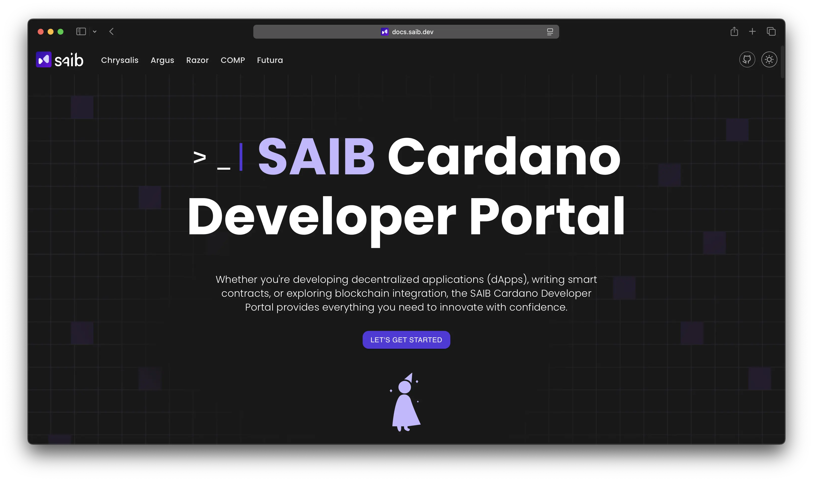

<div align="center">
  
  
  <a href="https://github.com/SAIB-Inc/docs.saib.dev/blob/main/LICENSE">
    
  </a>
  <a href="https://github.com/SAIB-Inc/docs.saib.dev/fork">
    
  </a>
  <a href="https://github.com/SAIB-Inc/docs.saib.dev/stargazers">
    
  </a>
  <a href="https://github.com/SAIB-Inc/docs.saib.dev/graphs/contributors">
    
  </a>
  <br>
  <a href="https://docusaurus.io/">
    
  </a>
  <a href="https://bun.sh/">
    
  </a>
  <a href="https://reactjs.org/">
    
  </a>
</div>

## 📖 Overview

Welcome to the official repository for the SAIB Developer Portal. This documentation site serves as a comprehensive resource hub for developers working with SAIB's suite of Cardano blockchain development tools.

## 🚀 Features

- **Comprehensive Documentation**: Detailed guides, API references, and examples for all SAIB products
- **Product Showcase**: Centralized information on Chrysalis, Argus, Razor, COMP, and Futura
- **Modern UI**: Clean, responsive design built with Docusaurus and React
- **Dark Mode Support**: Customizable UI with light and dark themes
- **Search Functionality**: Quick access to documentation content
- **Mobile Friendly**: Optimized experience across all devices

## 🧩 Products Documented

The portal provides documentation for SAIB's suite of Cardano development tools:

| Product       | Description                                  | Status         |
| ------------- | -------------------------------------------- | -------------- |
| **Chrysalis** | .NET building blocks for Cardano development | ✅ Complete    |
| **Argus**     | .NET indexing framework for Cardano          | ✅ Complete    |
| **Razor**     | Specialized Cardano tool                     | 🚧 Coming Soon |
| **COMP**      | Specialized Cardano tool                     | 🚧 Coming Soon |
| **Futura**    | Specialized Cardano tool                     | 🚧 Coming Soon |

## 📥 Installation

```bash
# Install dependencies using bun
bun install
```

## 🔄 Development

```bash
# Start local development server
bun start

# For CSS changes (tailwind)
bun watch:css
```

The development server will start at `http://localhost:3000` with hot-reloading enabled.

## 🏗️ Build

```bash
# Build the CSS files
bun build:css

# Build the static site
bun build

# Serve the built website locally
bun serve
```

## 🧩 Architecture

The project follows Docusaurus's recommended structure with some customizations:

```
docs.saib.dev/
├── docs/              # Documentation content organized by product
│   ├── chrysalis/     # Chrysalis documentation
│   ├── argus/         # Argus documentation
│   └── ...            # Other product docs
├── src/               # React components and frontend code
│   ├── components/    # UI components 
│   ├── pages/         # Main page definitions
│   ├── theme/         # Docusaurus theme customizations
│   └── styles/        # CSS and styling
├── static/            # Static assets
│   └── img/           # Images and icons
├── docusaurus.config.ts  # Main configuration
└── sidebars.ts        # Sidebar configuration
```

## 🧠 Contributing

We welcome contributions to improve the developer portal! Please follow these steps:

1. Fork the repository
2. Create a feature branch (`git checkout -b feature/amazing-feature`)
3. Make your changes
4. Commit your changes (`git commit -m 'Add some amazing feature'`)
5. Push to the branch (`git push origin feature/amazing-feature`)
6. Open a Pull Request

## 📝 License

This project is licensed under the MIT License - see the LICENSE file for details.

---

<div align="center">
  <p>Made with ❤️ by <a href="https://saib.dev">SAIB Inc</a> for the Cardano community</p>
</div>